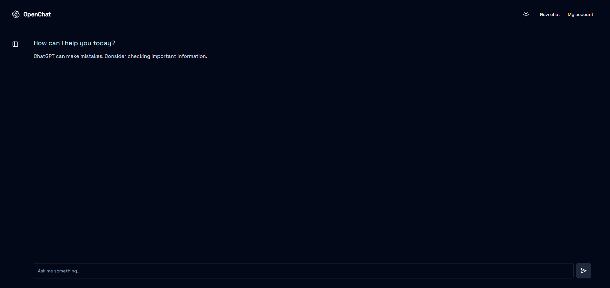
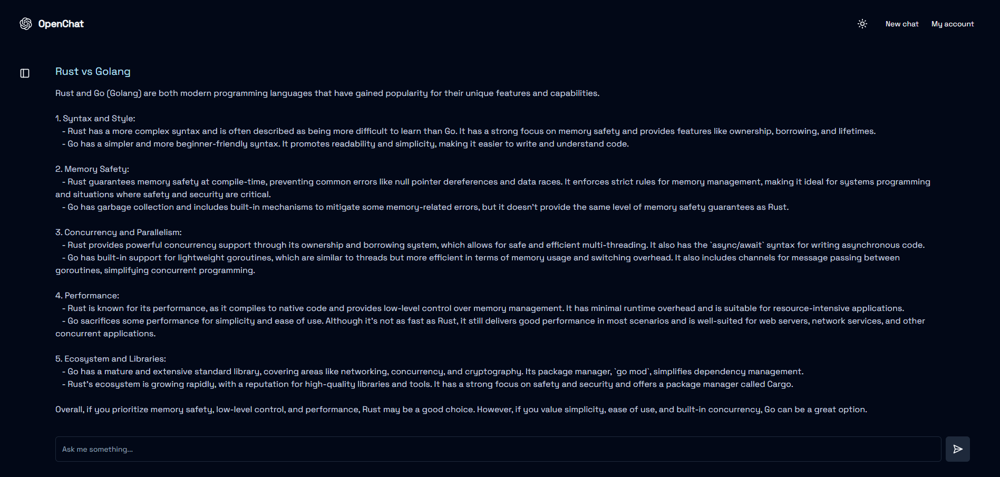

<<<<<<< HEAD
# ColabGPT - Azure AI Edition

This is a [Next.js](https://nextjs.org/) project that provides a ChatGPT-like interface where users can have conversations with an AI assistant powered by Azure AI.
=======
# Colabgpt - Firebase Edition


>>>>>>> 048f1d02d9f0a454d48668c7e79634fdd5fea667

## Features

- **Firebase Authentication**: Email/password authentication
- **Firestore Database**: Store conversations and user data
- **Organization Management**: First user becomes admin and can invite team members
- **Azure AI Management**: Admin can provide Azure AI credentials for the entire organization
- **Dark/Light Mode**: Theme support for user preference
- **Responsive Design**: Works on mobile and desktop

## Tech Stack

- NextJS 14, RSC, Server actions
- Firebase (Authentication, Firestore)
- Shadcn-ui
- Azure AI
- TailwindCSS

## Getting Started

1. Clone the repository
2. Install dependencies:

```bash
npm install
# or
yarn install
# or
pnpm install
```

3. Set up Firebase:
   - Create a Firebase project at [Firebase Console](https://console.firebase.google.com/)
   - Enable Authentication (Email/Password)
   - Create a Firestore database
   - Add your Firebase configuration to `.env` file (use `.env.example` as a template)

4. Run the development server:

```bash
npm run dev
# or
yarn dev
# or
pnpm dev
```

5. Open [http://localhost:3000](http://localhost:3000) with your browser to see the result.

## How It Works

1. **Authentication**: Users sign up with email/password using Firebase Authentication
2. **Organization**: The first user to sign up becomes the admin of the organization
3. **Azure AI**: The admin provides Azure AI credentials that will be used by all team members
4. **Team Management**: Admin can invite team members to join the organization
5. **Chat**: Users can have conversations with the AI using the organization's Azure AI service

## Preview





